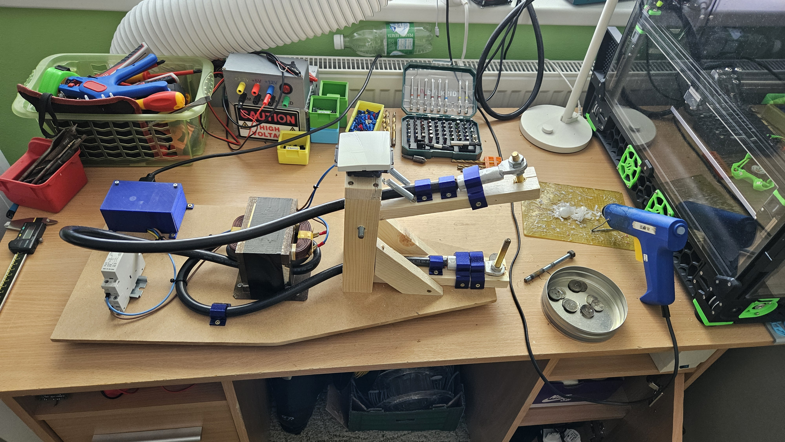
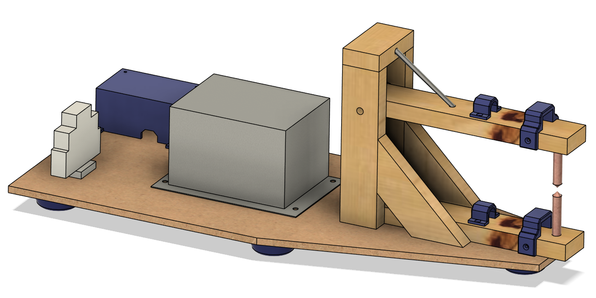

# MOT-Welder

Made as part of Arcade Hack Club

Used github copilot and Codeium when writing README

In this project, I tried to make a spot welder from a motor and a microwave oven transformer (MOT). But I ended up with more of a metal melter.

## DISCLAIMER
This project involves working with mains voltage electricity and very high current and can be dangerous. I am not responsible for any damage or injury caused by following this guide.
Open a microwave oven has killed people before, so proceed at your own risk.
I will not show how to extract and modify the MOT, as there are better and safer guide on the internet.

/////// Video /////////

## Parts
- 1x Modified MOT
- 1x 230V AC Contactor
- 40mm of DIN rail
- 1x 230V NO Button (I wanted to use a round red one, but I recieved a NC one, so I user a simple light switch)
- 1x 230V Switch
- 1x C13 Socket
- 2x M3x8mm screws
- 1x Wire + ferrules and spade connectors
- 1x 600x250x8mm MD board
- 5x 3D printed Foot
- 2x 3D printed Lug clip
- 4x 3D printed Wire clip
- estimated 2m of 44x19mm wood
- 2x Spring (optional)
- Threaded rod and nuts to fit your wire lugs (USE COPPER ROD, I wanted to save money and ordered it from aliexpress, but I recieved brass and it is slowly melting and it does not conduct the high current well)
- M8 threaded rod
- 2x 608 bearings (optional)
- Bunch of 3.5x12mm and 3.5x16mm screws
- 2x M3 threaded inserts and M3x8mm screws for the cover
- 1x 3D printed cover
- Hot glue

## Aligning the elctrodes

