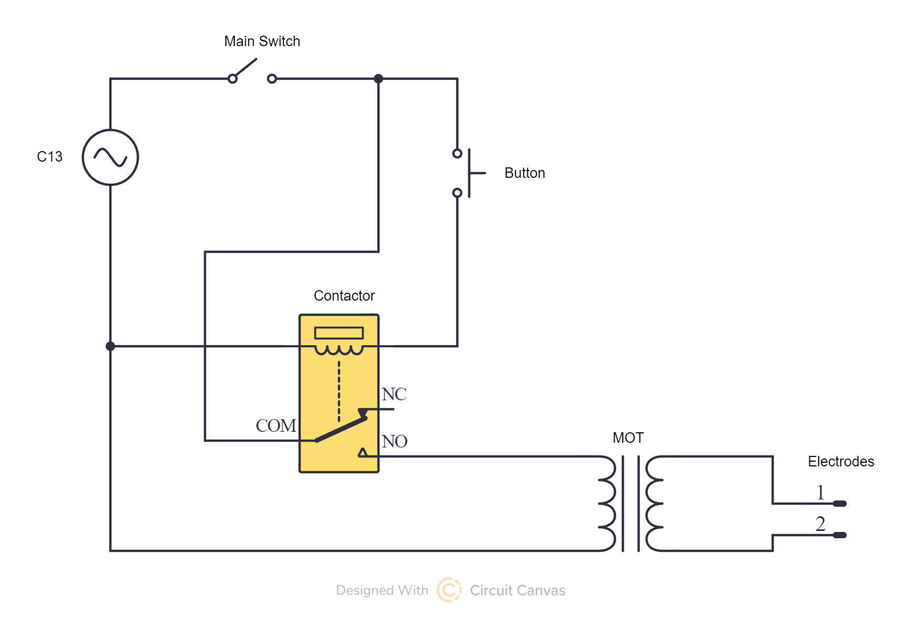

# MOT-Welder

Made as part of Arcade Hack Club

Used github copilot when writing README

In this project, I tried to make a spot welder from modified microwave oven transformer (MOT). But I ended up with more of a metal melter.

## DISCLAIMER
This project involves working with mains voltage electricity and very high current and can be dangerous. I am not responsible for any damage or injury caused by following this project.
Open a microwave oven has killed people before, so proceed at your own risk.
I will not show how to extract and modify the MOT, as there are better and safer guides on the internet.

https://github.com/user-attachments/assets/bb9bf38d-04f5-4f14-8f78-29b9427322f9

## Parts
- 1x Modified MOT
- 1x 230V AC Contactor
- 40mm of DIN rail
- 1x 230V NO Button (I wanted to use a round red one, but I recieved a NC one, so I user a simple light switch)
- 1x 230V Switch
- 1x C13 Socket
- 2x M3x8mm screws
- 1x Wire + ferrules and spade connectors
- 1x 600x250x8mm MD board
- 5x 3D printed Foot
- 2x 3D printed Lug clip
- 4x 3D printed Wire clip
- estimated 2m of 44x19mm wood
- 2x Spring (optional)
- Threaded rod and nuts to fit your wire lugs (USE COPPER ROD, I wanted to save money and ordered it from aliexpress, but I recieved brass and it is slowly melting and it does not conduct the high current well)
- M8 threaded rod
- 2x 608 bearings (optional)
- Bunch of 3.5x12mm and 3.5x16mm screws
- 2x M3 threaded inserts and M3x8mm screws for the cover
- 1x 3D printed cover
- Hot glue

## Aligning the elctrodes

The better the alignment, the easier the welding. When the electrodes are not aligned, its tricky to hold the parts in place and the welds are not as strong. At first I used hot glue to hold the wire lugs in place, but it got soft and melted on the first use. I then shimmed the bottom electrode with a coin and it worked much better. The top electrode can be adjusted by enlarging the hole in the top wooden arm.

## Schematic

The main switch can cut power to everything, the button is used to activate the contactor. The contactor is switches the mains power to the MOT. The MOT is connected directly to the electrodes.
